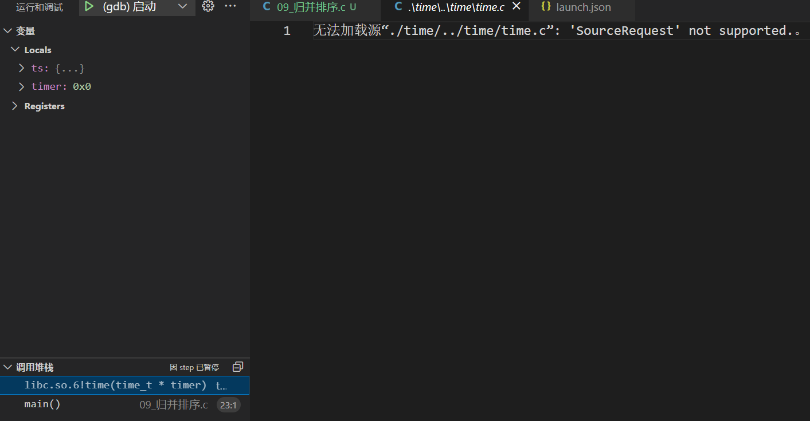
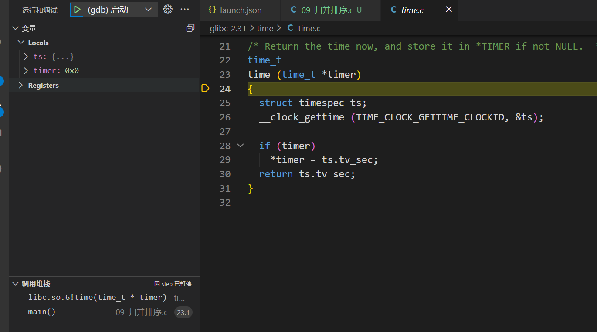

# VScode远程环境部署

## 1. 资源下载

VScode官方下载地址

> [Visual Studio Code - Code Editing. Redefined](https://code.visualstudio.com/)

VScode插件市场

> [Extensions for Visual Studio family of products | Visual Studio Marketplace](https://marketplace.visualstudio.com/VSCode)

## 2. SSH远程连接服务器

* 下载下图中的`Remote - SSH`和`Remote - SSH: Editing Configuration Files`插件并安装,配置对应ssh连接


* 连接建立后会在~/.vscode-server目录下生成一个与本地VS Code提交序号名称相同的文件夹,内部存放着远程SSH连接相关配置文件


* 若出现连接时一直处于加载状态

1. 可进入~/.vscode-server/bin中对应的文件夹，中是否存在一个大小为零的压缩包,若存在则需手动下载相关配置文件并解压至 \~ /.vscode-server/bin/b3e4e68a0bc097f0ae7907b217c1119af9e03435目录下,其中commit_id为上图中的`提交`

   ```html
   https://vscode.cdn.azure.cn/stable/${commit_id}/vscode-server-linux-x64.tar.gz
   ```

2.   进入~/.vscode-server/bin/b3e4e68a0bc097f0ae7907b217c1119af9e03435目录中查看是否存在如下文件`vscode-remote-lock.pi.b3e4e68a0bc097f0ae7907b217c1119af9e03435`若此前非正常退出则可能导致锁未被释放导致后续无法正常接入，手动删除锁即可

## 3. 公钥部署实现免密登录

* 在windows的命令行环境下手动执行ssh-keygen生成公钥`C:\Users\username\.ssh\id_rsa.pub`和私钥`C:\Users\username\.ssh\id_rsa`
* 在Linux环境下~/.ssh目录下创建文件`authorized_keys`将windows生成的公钥复制粘贴在最后即可

## 4.参数配置

* 在顶部栏显示搜索框和前进后退箭头键位

  > 文件–>首选项–>设置–>搜索`Command Center`并勾选开启

* 设置120字符提示线

  > 文件–>首选项–>设置–>搜索`editor.rulers`--》更改设置`"editor.rulers": [120]`

## 5. 常用插件

* Chinese (Simplified) (简体中文) Language Pack for Visual Studio Code

  为VS Code提供本地汉化界面

  

* Git History

  查看Git提交历史记录

  

* GitLens

  提供强大的Git管理功能


##  6.vscode使用图形化界面GDB调试

   1. 安装微软官方提供的C/C++插件

   2. 配置将文件launch.json改为如下

      ```cpp
      {
          // 使用 IntelliSense 了解相关属性。 
          // 悬停以查看现有属性的描述。
          // 欲了解更多信息，请访问: https://go.microsoft.com/fwlink/?linkid=830387
          "version": "0.2.0",
          "configurations": [
              {
                  "name": "(gdb) 启动", //配置名称，显示在配置下拉菜单中
                  "type": "cppdbg", //配置类型
                  "request": "launch", //请求配置类型，可以是启动或者是附加
                  "program": "${fileDirname}/a.out", //程序可执行文件的完整路径，${workspaceFolder}表示远程连接的初始路径
                  "args": [], //传递给程序的命令行参数
                  "stopAtEntry": true, //可选参数，如果为true,调试程序应该在入口（main）处停止
                  "cwd": "${workspaceFolder}", //用于查找依赖项和其他文件的当前工作目录
                  "environment": [], //表示要预设的环境变量
                  "externalConsole": false, //如果为true，则为调试对象启动控制台
                  "MIMode": "gdb", //要连接到的控制台启动程序
                  "setupCommands": [ //为了安装基础调试程序而执行的一个或多个GDB/LLDB命令
                      {
                          "description": "开启pretty-printer",
                          "text": "-enable-pretty-printing",
                          "ignoreFailures": true
                      },
                      {
                          "description": "设置反汇编风格为inter",
                          "text": "-gdb-set disassembly-flavor intel",
                          "ignoreFailures": true
                      }
                  ]
              }
          ]
      }
      ```

##  6.调试标注库函数

   * 在调试时如果单步执行遇到库函数`srand(time(NULL));`则GDB会提示无法加载源文件

     

   * 此时代码中的`time(NULL)`函数指向libc.so.6库，由于在GDB配置路径中不存在对应版本的glibc源代码所以无法正常跳转至函数定义处

     >  /lib/x86_64-linux-gnu/libc.so.6是Linux操作系统中的动态链接库，全称为C标准库。在Linux系统中，所有使用C语言编写的程序都需要使用C标准库提供的函数、变量和常量。C标准库的主要功能包括文件操作、字符串操作、数学计算、内存管理、时间处理、网络通信等方面。C标准库是Linux操作系统中的一项核心组件，对于开发Linux应用程序非常重要。/lib/x86_64-linux-gnu/libc.so.6这个文件是C标准库的本地动态链接库，也就是所谓的libc库。在运行Linux程序时，如果发现程序需要用到C标准库中的函数或变量，就会自动调用该库中相应的代码来完成操作

     

   * 通过ldd --version、直接执行对应的libc.so.6文件都可以找到自身系统的libc.so.6对应的glibc版本是多少

     

   * 下载对应版本的glibc源代码，并将源代码目录放在配置文件中的`"cwd": "${workspaceFolder}/glibc-2.31",`中，此时再使用gdb调试遇到库函数时便会跳转至glibc源码中对应的函数实现

