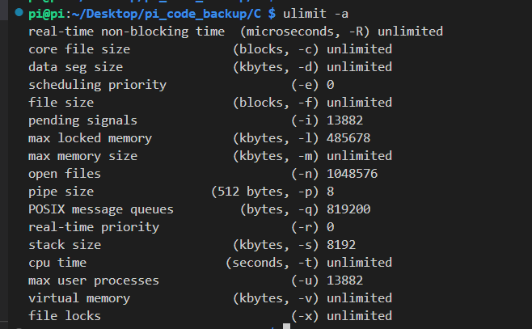

# coredump文件相关设置

## 1.coredump文件简介

core dump，又称为核心转储，是操作系统在进程收到某些信号而终止运行时，将此时进程地址空间的内容以及有关进程状态的其他信息写出的一个磁盘文件
coredump文件含有当进程被终止时内存、CPU寄存器和各种函数调用堆栈信息等，可以供后续开发人员进行调试

## 2.查看coredump文件是否可以生成

可以使用`ulimit -a`查看相关设置,core file size为coredump文件大小限制

* ulimit -c unlimited 不限制生成core文件大小
* ulimit -c 0 关闭core文件生成开关
* ulimit -c 1024 限定生成core文件的大小为1024kb


## 3.设置coredump文件大小

1. 修改`/etc/security/limits.conf`修改系统对coredump文件大小限制；有soft，hard和-，soft指的是当前系统生效的设置值，软限制也可以理解为警告值。hard表明系统中所能设定的最大值。soft的限制不能比hard限制高


1. 在终端中输入`ulimit -c 文件大小`临时设置coredump文件大小

## 4.设置core文件名称和生成路径

1. 临时设置，重启后失效  
    可以通过修改文件`/proc/sys/kernel/core_pattern`内容指定产生coredump文件的路径和名称
2. 永久设置  
    增加如下配置到`/etc/sysctl.conf`文件中  

    ``` cpp
    //设置core文件保存配置 = 文件路径/文件名称
    kernel.core_pattern = ./%e-%p.core
    ```

相关名称设置可以参考下列列表

* %% 单个%字符
* %p 所dump进程的进程ID
* %u 所dump进程的实际用户ID
* %g 所dump进程的实际组ID
* %s 导致本次core dump的信号
* %t core dump的时间 (由1970年1月1日计起的秒数)
* %h 主机名
* %e 程序文件名

## 5.coredump文件解析

1. 例如编译运行如下代码，生成coredump

    ``` c
    void dumpCrash()
    {
        char *pStr = "test_content";
        free(pStr);
    }

    int main()
    {
        dumpCrash();
        return 0;
    }
    ```

2. 使用coredump文件命令为`gdb 引发coredump文件 core文件`  
  

3. 然后输入`bt`查看函数调用栈  

